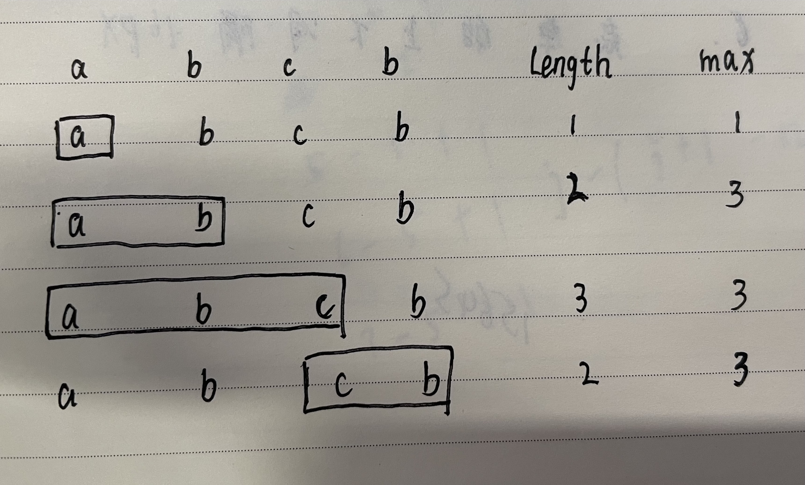

## 题目地址

https://leetcode-cn.com/problems/longest-substring-without-repeating-characters/

## 题目描述

```

给定一个字符串，请你找出其中不含有重复字符的 最长子串 的长度。

 

示例 1:

输入: s = "abcabcbb"
输出: 3 
解释: 因为无重复字符的最长子串是 "abc"，所以其长度为 3。

```

## 解答

### 滑动窗口

我觉得这个比较好理解，也比较简单，其他的可以使用双指针方式等等

#### 思路



1. 使用一个数组arr来作为滑动窗口。

2. 遍历字符串，判断字符串是否在滑动窗口数组里面：

-   不在则将这个字符串加入到滑动窗口
-   在则删除滑动窗口里相同字符以及相同字符前的字符，然后将这个字符串加入到滑动窗口
-   然后将max更新为当前最长子串的长度

3. 遍历完成，返回max。

#### 代码

```js

/**
 * @param {string} s
 * @return {number}
 */
 
var lengthOfLongestSubstring = function(s) {
    let arr = []
    let max = 0

    for (let i = 0; i < s.length; i++) {
      if(arr.includes(s[i])) {
        arr.splice(0, arr.findIndex(item => item === s[i]) + 1)
      }
      arr.push(s[i])
      max = Math.max(arr.length, max)
    }

    return max
}

```