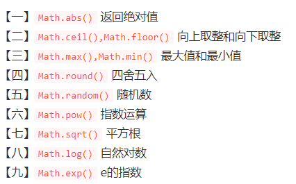

## 题目地址

https://leetcode-cn.com/problems/reverse-integer/

## 题目描述

```

给你一个 32 位的有符号整数 x ，返回将 x 中的数字部分反转后的结果。

如果反转后整数超过 32 位的有符号整数的范围 [−231,  231 − 1] ，就返回 0。

假设环境不允许存储 64 位整数（有符号或无符号）。
 

示例 1：

输入：x = 123
输出：321

```

## 解答

### 方法一：暴力解法，转为字符串反转

提到反转，我的第一下想到的是数组的 `reverse()` 方法，所以直接开干。

#### 思路

思路很简单暴力：

1. 用ES6 的 `Math.sign()` 保存符号，正数是1，负数是-1.
2. 取绝对值，转换为字符串，转成数组，使用 `reverse()` 方法，再转回来就可以了。

#### 代码

```js

/**
 * @param {number} x
 * @return {number}
 */

var reverse = function(x) {
  let s = Math.sign(x)

  let res = (Math.abs(x) + '').split('').reverse().join('') * s

  return res > Math.pow(2, 31) - 1 || res < Math.pow(-2, 31) ? 0 : res
}

```

### 方法二：取余

这个方法思路是比较简单的，一些方法用的好就变得很简洁，下面是引用了题解中的某位大神的思路和代码

```
作者：zoffer
链接：https://leetcode-cn.com/problems/reverse-integer/solution/wei-yun-suan-ji-jian-jie-fa-by-ijzqardmbd/
来源：力扣（LeetCode）

```

自己也用了这个方法，但在题解中看到这个大佬的写的，感觉自己的积累还是不够，说说自己的解法吧：

-   还是用ES6 的 `Math.sign()` 保存符号，取绝对值再算。为什么会这样想？我不知道负数取余得负数。
-   使用 `Math.floor()` 向下取整，但是负数得向上取整。
-   判断超出界限返回0： `res > Math.pow(2, 31) - 1 || res < Math.pow(-2, 31)`。

而大佬的思路：


#### 大佬的思路

1. result * 10 + x % 10 取出末位 x % 10（负数结果还是负数，无需关心正负），拼接到 result 中。

2. x / 10 去除末位，| 0 强制转换为32位有符号整数。

3. 通过 | 0 取整，无论正负，只移除小数点部分（正数向下取整，负数向上取整）。

4. result | 0 超过32位的整数转换结果不等于自身，可用作溢出判断。

#### 代码

```js

/**
 * @param {number} x
 * @return {number}
 */

var reverse = function(x) {
  let result = 0

  while(x !== 0) {
      result = result * 10 + x % 10
      x = (x / 10) | 0
  }
  return (result | 0) === result ? result : 0
}

```

### 补充

两个知识点：
1. 常用的 `Math` 方法；



2. JS位运算符的妙用与原理，看链接：https://www.jianshu.com/p/d2a8e5b9774e
